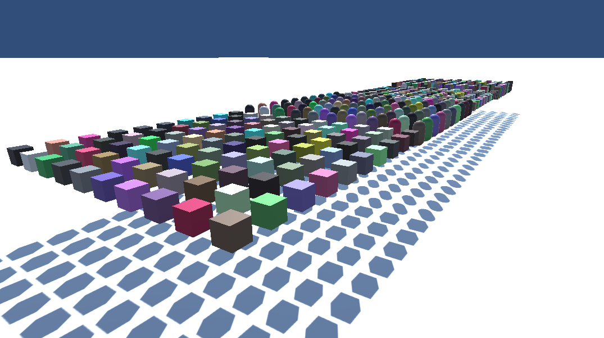

# DrawMeshInstanceIndirect examples.
Exploring the Unity 5.6 DrawMeshInstanceIndirect method to render large numbers of objects.

### InstancedIndirectExample
The example on scene InstancedIndirectExample is a slightly expanded version of [Unity's sample](https://docs.unity3d.com/560/Documentation/ScriptReference/Graphics.DrawMeshInstancedIndirect.html) code provided by [noisecrime](https://github.com/noisecrime/Unity-InstancedIndirectExamples). The buffer is created in CPU and the position sampled in GPU. This approach is useful when the positions are static, otherwise the cost of update from CPU is very high.

### InstancedIndirectComputeExample
The example on scene InstancedIndirectComputeExample demonstrates the use of Compute Shaders to generate position data. Compute Shaders are specially useful when the buffers need constant update, as the buffer remains in GPU and we can take advantage of many threads to perform the calculations. 

### InstancedIndirectNoBuffer
The example on scene InstancedIndirectNoBuffer shows how to position the objects on the fly, directly within the shader. This approach eliminates the use of any auxiliar buffer, and positions can be calculated directly in the surface shader. This is very attractive for when the calculations are simple and the number of instances is very high.

### InstancedIndirectComputeAppend
The example on scene InstancedIndirectComputeAppend shows how to render instances when the number of elements is not known beforehand. 
A compute is dispatched with N threads but not all of them assign values to the position buffer. An AppendStructuredBuffer is used in this case [+info](https://msdn.microsoft.com/en-us/library/windows/desktop/ff471448(v=vs.85).aspx). As the CPU does not know how many instances were created, we use the CopyCount function to update the args buffer that is passed to the DrawMeshInstancedIndirect function.

### InstancedIndirectShadowsIssue

There is an open issue in Unity 5.6b that, when issuing several drawcalls using DrawMeshInstancedIndirect the shadow is broken. The bug was reported [here](https://issuetracker.unity3d.com/issues/drawmeshinstanceindirect-wrong-computebuffer-being-passsed-to-consecutive-drawmesh-calls). A blog post discussing it can be found [here](https://forum.unity3d.com/threads/drawmeshinstancedindirect-example-comments-and-questions.446080/#post-2995966).
Here's the workaround:

* If you duplicate the shader file, and rename it. Add each duplicate to a different material, it works. Which indicates that Unity is having troubles differentiating among the materials, and is trying to batch them somehow. 
*  So I had to find a way to force Unity disable whatever it was that was not separating the materials. Creating the material from code (using the shader or the original material) was not working
*  The uniforms I was passing with the materials were different from each other, but that didn't do it.
*  The only thing left was the MaterialPropertyBlock (which I wasn't using). Setting an empty mpb per draw call also didn't work.
*  What did work was to set an unique dummy variable per mpb, so that Unity will have to issue a different call. The variable doesn't even have to be used in the shader.

        for (int i = 0; i < meshes.Length; i++)
        {
            materials[i].SetFloat("_Dim", gridDim);
            .......
            /// this is the magic line. Uncomment this for shadows!! 
            mpbs[i].SetFloat("_Bla", (float)i);
            Graphics.DrawMeshInstancedIndirect(meshes[i], 0, materials[i], meshes[i].bounds, argsBuffers[i], 0, mpbs[i], castShadows, receiveShadows);
        }

It is not ideal, but it works!! Image with 4 draw calls (one per different group).

** NOTE: these are WIP demos.

